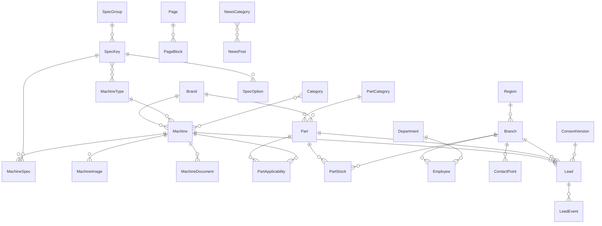

# Модерн Машинери Фар Ист — план работ. Этап 0 и Этап 1

Документ для внутренней подготовки и для первой встречи с заказчиком.

> **Область проекта: сайт филиала в Хабаровске, а не корпоративный сайт группы.**
> Разделы 1–6 описывают компанию и архитектуру целиком — это нужно, чтобы понимать контекст и не спроектировать тупик. **Раздел 7 сужает объём до Хабаровска и корректирует сроки, схему БД и SEO-стратегию. Читать его обязательно — он переопределяет часть решений выше.**

---

## 1. Заказчик и область деятельности

**ООО «Модерн Машинери Фар Ист»** — один из крупнейших поставщиков спецтехники, оборудования и запасных частей на Дальнем Востоке России. Официальный дистрибьютор Komatsu, Komatsu Mining, Sennebogen, Manitou, BOMAG, Denyo, Terex Cranes, Generac Mobile, TECHKING.

**Направления бизнеса:**

| Направление | Суть |
|---|---|
| Продажа техники | Горная, строительная, дорожная, портовая, складская техника; горно-шахтное оборудование; электрооборудование |
| Запасные части | Оригинальные запчасти Komatsu, ходовая часть, фильтры, ковши, гидромолоты, РВД, смазочные материалы, шины |
| Сервис | 25+ сервисных центров, 700+ механиков, круглосуточная поддержка, лаборатория анализа масел |
| «Реман» | Завод в Магадане по восстановлению компонентов Komatsu до состояния новых |
| Учебный центр | Обучение специалистов заказчика, программы (стропальщик, охрана труда), симуляторы Immersive Technologies |

**География:** головной офис — Магадан. Филиалы: Хабаровск, Южно-Сахалинск, Петропавловск-Камчатский (Нагорный), Артём, Сусуман, Билибино. Территория дистрибьюции — весь ДФО плюс Забайкалье и Бурятия.

**Клиент:** более 1000 горнодобывающих, строительных, дорожных, портовых, лесозаготовительных и коммунальных предприятий. Это чистый B2B: сделки по счёту, длинный цикл, ЛПР — снабженец и главный механик.

**Текущее состояние IT:**

- Сайт `modernmachinery.ru` на **Joomla**, поддерживается сторонним подрядчиком (Nominis Group). Каталог — фактически набор статических страниц без фильтров, поиска и остатков.
- В меню есть «мёртвые» пункты-заглушки (`-`, `--`, `---`, `javascript:void(0)`) — признак того, что структуру давно не приводили в порядок.
- Есть вендорские системы **KOMTRAX** и **My Komatsu** — их **не трогаем и не дублируем**.
- Почти наверняка есть 1С (подтвердить на аудите).
- Счётчик Яндекс.Метрики `29739990`, верификация Яндекс.Вебмастера в meta — переносить обязательно.

---

## 2. Идея

Компания сама планирует менять сайт. Заходим через задачу, которую они уже готовы оплачивать, — **новый сайт с полноценным каталогом техники и запчастей**, — но проектируем его не как «сайт-визитку», а как **фундамент будущего личного кабинета клиента**.

Ключевая мысль для питча:

> Сайт — это витрина. Но за витриной у вас 1000 предприятий, у каждого парк техники, наработка, ТО и заявки. Мы делаем сайт так, чтобы через полгода поверх него включился личный кабинет, а не так, чтобы его пришлось переписывать.

Технически это значит: с первого дня **API-first** архитектура (DRF), нормальная модель данных по технике/запчастям/филиалам, отдельный слой интеграций. Каталог этапа 1 и парк техники клиента этапа 2 — это одни и те же сущности.

**Что продаём на этом контракте:** сайт + каталог + админка + миграция контента + SEO-перенос.
**Что показываем в roadmap, но не продаём сейчас:** личный кабинет, сервисные заявки, остатки из 1С, планировщик ТО.

---

## 3. Этап 0. Подготовка к встрече (1–2 недели, до подписания)

Цель — прийти не с презентацией, а с работающим прототипом на их собственных данных. Это единственный способ выделиться на фоне веб-агентств.

### 3.1. Разведка и парсинг старого сайта

Нужно два разных парсинга — не путать их.

**A. Парсинг структуры сайта (для миграции и для оценки объёма работ)**

Что собираем:

- `sitemap.xml` и полный обход по внутренним ссылкам — список всех URL.
- Для каждой страницы: URL, `title`, `meta description`, `h1`, тип страницы (каталог / карточка / текстовая / новость / контакты), дата, объём текста.
- Дерево меню целиком, с пометкой пунктов-заглушек.
- Инвентаризация изображений и PDF (каталоги, спецификации, прайсы).

Результат — таблица на 200–500 строк. Она нужна для трёх вещей: оценка объёма контента, карта 301-редиректов, список того, что вообще не надо переносить.

**B. Парсинг карточек техники (для демо и для наполнения)**

Берём 30–50 позиций из разделов Komatsu / Terex Cranes / Generac Mobile / складская и дорожная техника.

Для каждой: название, модель, бренд, категория, описание, технические характеристики (таблица «параметр — значение — единица»), изображения.

Главная сложность — **характеристики у них лежат неструктурированно**, в вёрстке страниц. Нужен нормализатор: приведение названий параметров к единому словарю (`Эксплуатационная масса`, `Мощность двигателя`, `Объём ковша`, `Глубина копания`…), разбор значений в число + единица измерения. Это то, что делает возможными фильтры «мощность от–до» — то, чего у них сейчас нет. **Это и есть главный вау-эффект демо.**

**Технически:**

```
scripts/
  crawl_sitemap.py      # обход, инвентаризация → CSV
  parse_machines.py     # карточки техники → JSON
  normalize_specs.py    # словарь параметров, парсинг значений
  download_media.py     # изображения по локальным путям
data/
  raw/        # сырой HTML (кэш, чтобы не долбить сайт повторно)
  parsed/     # JSON
  media/
```

`requests` + `BeautifulSoup4` + `lxml`. Не Scrapy — избыточно для 500 страниц. Обязательно: кэш сырого HTML на диск, задержка между запросами 1–2 с, честный User-Agent, соблюдение `robots.txt`. Сайт заказчика — не тот ресурс, который стоит нагружать.

> Дисклеймер для встречи: парсинг делался в объёме, достаточном для демонстрации, с щадящей нагрузкой. Полная миграция контента будет выполняться по согласованию, в идеале — выгрузкой из Joomla напрямую (доступ к БД или экспорт).

### 3.2. Демо-прототип (главный артефакт этапа 0)

Мини-приложение на Django, задеплоенное на VPS с временным доменом. Ставим только то, что бьёт в глаза за 2 минуты:

1. **Каталог с фильтрами** — 30–50 реальных машин. Фильтры по бренду, категории, мощности, эксплуатационной массе, объёму ковша. Мгновенный отклик.
2. **Карточка машины** — характеристики в нормальном виде, галерея, кнопка «Запросить цену».
3. **Поиск по каталогу** — по модели и по названию, с опечатками (`pg_trgm`).
4. **Мобильная вёрстка** — половина снабженцев смотрит с телефона.
5. **Калькулятор стоимости владения** — простой лид-магнит: моточасы в год, расход, стоимость ТО → стоимость часа работы машины. Дёшево делается, отлично продаётся маркетингу.

Не тратим время на: дизайн-систему, анимации, идеальную вёрстку. Прототип должен выглядеть аккуратно и работать быстро — этого достаточно.

### 3.3. Вопросы для аудита (задать на встрече)

Ответы определяют этап 2 и цену интеграции. Без них любой план — угадайка.

**Про бизнес**
- Кто владелец сайта внутри компании: маркетинг, IT, коммерческая дирекция? Кто подписывает?
- Что не устраивает в текущем сайте? Какая метрика важна: заявки, звонки, узнаваемость?
- Есть ли задача сделать англоязычную версию?

**Про системы**
- Что стоит: 1С УТ / ERP / УНФ? Какая версия, кто сопровождает?
- Есть ли CRM? Где сейчас живут лиды с сайта?
- Как ведутся остатки запчастей по складам? Возможна ли выгрузка?
- Кто отвечает за KOMTRAX / My Komatsu, какие данные оттуда доступны?

**Про процессы (задел под этап 2–3)**
- Как сейчас клиент подаёт заявку в сервис? Телефон, почта, Excel?
- Как механик на объекте отчитывается о выполненной работе?
- Кто наполняет контент сайта и сколько человек это делают?

**Про инфраструктуру**
- Где хостится сайт? Есть ли требование размещения в РФ (152-ФЗ — при персональных данных обязательно)?
- Кто владеет доменом и DNS?
- Есть ли внутренние требования ИБ / согласование подрядчиков?

### 3.4. Пакет на встречу

- Ссылка на живое демо (не скриншоты).
- Одностраничник: что делаем на этапе 1, сроки, состав работ, цена.
- Roadmap на слайд: этапы 2–5 крупными мазками, без цен.
- Список вопросов из 3.3 — задавать, а не зачитывать.

**Правило встречи:** 70% времени слушаем, 30% показываем. Продаёт не список функций, а то, что ты единственный, кто пришёл с их техникой на экране.

---

## 4. Этап 1. Новый сайт и каталог на Django

**Срок соло:** 8–10 недель.
**Итог:** работающий сайт в проде, наполненный контентом, с переносом SEO и обученным контент-менеджером.

### 4.1. Стек и обоснование

| Слой | Решение | Почему |
|---|---|---|
| Backend | Django 5 + DRF | Основной стек, API-first задел под кабинет |
| БД | PostgreSQL 16 | JSONB под характеристики, `pg_trgm` для поиска |
| Кэш / очереди | Redis + Celery | Кэш каталога, фоновый импорт, отправка почты |
| Фронт | Django-шаблоны + HTMX + Alpine.js | **Осознанный выбор:** SEO из коробки, один разработчик, никакой SSR-возни. SPA здесь — лишний риск и лишние деньги |
| Стили | Tailwind | Быстро, предсказуемо |
| Поиск | PostgreSQL FTS + trigram | Elasticsearch на 500 SKU не нужен |
| Медиа | S3-совместимое хранилище + WebP | Много тяжёлых фото техники |
| Инфра | Docker Compose, nginx, gunicorn, Certbot | Разворачивается на одном VPS в РФ |
| Мониторинг | Sentry + healthcheck | Обязательно, иначе поддержка вслепую |

**Отдельное решение — админка.** Стандартной Django-админки для контент-менеджера маловато (нужны блоки, картинки, черновики). Варианты: `django-admin` + `django-ckeditor` + inline-формы (дёшево, быстро) или Wagtail (дороже на старте, приятнее в эксплуатации). Рекомендация: **обычная админка с доработкой**, потому что 90% контента — структурированный каталог, а не свободные лендинги.

### 4.2. Модель данных (обзор)

Подробная проработка схемы, обоснование решений и код моделей — в разделе 6. Здесь — только карта сущностей.

Проектируем сразу под этап 2. Ключевое: `Machine` — это модель техники в каталоге, а `MachineUnit` (единица с серийным номером, парк клиента) появится на этапе 2 и будет ссылаться на неё. Это закладываем сейчас, реализуем потом.

```
Brand            — Komatsu, BOMAG, Manitou, Terex, Denyo, Generac, TECHKING
Category         — дерево: Горная и строительная / Дорожная / Портовая /
                   Складская / Горно-шахтное / Электрооборудование
MachineType      — экскаватор, бульдозер, погрузчик, каток, кран, генератор
Machine          — модель: slug, бренд, тип, категории (M2M), описание,
                   is_active, seo-поля, порядок сортировки
SpecKey          — справочник параметров: код, название, единица, тип
                   (number/string/bool), фильтруемый ли, порядок вывода
MachineSpec      — Machine × SpecKey → value_num / value_str
                   (нормализованное значение, именно оно даёт фильтры)
MachineImage     — изображения с порядком и alt
MachineDocument  — PDF: спецификации, брошюры

PartCategory     — запчасти: оригинальные, ходовая, фильтры, ковши,
                   гидромолоты, РВД, смазочные, шины
Part             — артикул, название, категория, применимость (M2M к Machine),
                   заглушка под остатки (этап 3)

Branch           — филиал: город, адрес, телефоны, почта, координаты,
                   график, привязка к региону
Employee         — сотрудник филиала: ФИО, должность, телефоны, фото
                   (у них это уже есть на страницах филиалов)

Page             — статические страницы: О компании, История, Реман,
                   Учебный центр, Охрана труда
NewsPost         — новости с рубриками
Lead             — заявка с сайта: тип, контакты, привязка к Machine/Part,
                   источник, UTM, статус
RedirectRule     — карта 301 со старых URL
```

Характеристики через `SpecKey` + `MachineSpec`, а не JSON-поле: именно это даёт нормальные фильтры «мощность от–до» и сортировку. JSONB оставляем как хранилище сырых, ненормализованных данных парсера.

### 4.3. Поэтапный план по неделям

> Ниже — план в полном объёме (корпоративный сайт). Актуальный, суженный до Хабаровска вариант на 6–7 недель — в разделе 7.5.

**Неделя 1 — фундамент**
- Репозиторий, Docker Compose, настройки по окружениям, pre-commit (ruff, black), CI на прогон тестов.
- Модели `Brand`, `Category`, `MachineType`, `Machine`, `SpecKey`, `MachineSpec`, `MachineImage`. Миграции.
- Базовая админка.
- Согласование структуры разделов с заказчиком (карта сайта на утверждение) — **блокирующая задача, запускать в первый день**.

**Неделя 2 — импорт данных**
- Доработка парсера из этапа 0 до полного покрытия каталога.
- Management-команда `import_machines` — идемпотентный импорт из JSON: обновление по slug, без дублей, лог расхождений.
- Словарь `SpecKey` и правила нормализации — **основная ручная работа этапа**, закладывать 2–3 дня чистого времени.
- Загрузка и конвертация изображений в WebP, генерация превью.
- Отдельно: получить у заказчика доступ к экспорту из Joomla, если возможно — это точнее парсинга.

**Недели 3–4 — каталог**
- Листинг с фасетными фильтрами (бренд, категория, тип, числовые диапазоны), сортировка, пагинация.
- HTMX-обновление выдачи без перезагрузки, фильтры в URL (важно для SEO и для «скинуть ссылку коллеге»).
- Карточка машины: характеристики, галерея, документы, похожие модели, CTA.
- Поиск с автодополнением.
- Кэширование фасетов в Redis.
- DRF-эндпоинты `/api/v1/machines/`, `/api/v1/brands/` — задел под кабинет и мобильные клиенты.

**Неделя 5 — запчасти**
- `PartCategory`, `Part`, применимость к моделям техники.
- Разделы запчастей, страницы категорий, поиск по артикулу.
- Заглушка под остатки: поле есть, источник данных подключается на этапе 3. На карточке — «Уточнить наличие».
- Чистка структуры меню: убираем пункты-заглушки старого сайта.

**Неделя 6 — контентная часть**
- Статические страницы, новости, вакансии, охрана труда.
- Страницы филиалов с сотрудниками и картой (Яндекс.Карты).
- Страницы направлений: Сервисный центр, Реман, Учебный центр, Лаборатория анализа масел.
- Перенос текстов со старого сайта.

**Неделя 7 — заявки, формы, лиды**
- Формы: «Запросить цену», «Подобрать технику», «Заявка в сервис» (пока на почту), обратный звонок.
- Модель `Lead`, сохранение UTM и источника, письма ответственным по филиалам, антиспам (honeypot + rate limit, без reCAPTCHA — она в РФ работает нестабильно).
- Согласие на обработку персональных данных, политика конфиденциальности — **152-ФЗ обязателен**, хостинг в РФ.
- Калькулятор стоимости владения из демо — в прод.

**Неделя 8 — SEO-миграция и производительность**
- Карта 301-редиректов на основе инвентаризации из этапа 0. **Критично:** сайту 30 лет по бренду, ссылочная масса и позиции — реальный актив, потерять их легко.
- `sitemap.xml`, `robots.txt`, канонические URL, ЧПУ.
- Микроразметка schema.org: `Organization`, `Product`, `BreadcrumbList`, `LocalBusiness` для филиалов.
- Перенос счётчика Метрики `29739990` и meta-верификации Яндекс.Вебмастера.
- Open Graph, favicon, оптимизация изображений, Core Web Vitals.

**Недели 9–10 — запуск и сдача**
- Нагрузочная проверка, Sentry, бэкапы БД и медиа по расписанию.
- Стейджинг → приёмка заказчиком → правки.
- Переключение DNS, SSL, мониторинг 404 первую неделю.
- Инструкция для контент-менеджера + обучающая сессия (записать видео).
- Техническая документация, передача доступов.

### 4.4. Что НЕ входит в этап 1

Проговорить явно и письменно, иначе разрастётся:

- Интеграция с 1С и реальные остатки → этап 3
- Личный кабинет и авторизация клиентов → этап 2
- Онлайн-оплата (в B2B не нужна — работают по счёту)
- Телематика, KOMTRAX → отдельный продукт
- Англоязычная версия → отдельная оценка
- Наполнение полного каталога запчастей вручную (импорт — да, ручной ввод тысяч артикулов — нет)
- Дизайн с нуля от студии (либо адаптируем готовый шаблон, либо это отдельная статья бюджета)

### 4.5. Риски

| Риск | Как снимаем |
|---|---|
| Затягивание согласования структуры и текстов | Карта сайта утверждается на неделе 1, дедлайны на контент фиксируем в договоре |
| Данные старого сайта грязные, характеристик нет | Часть карточек заполняется вручную заказчиком; закладываем это в объём |
| Потеря SEO-позиций после переезда | Карта редиректов, мониторинг Вебмастера 4 недели после запуска |
| Требование хостинга и согласования по ИБ | Выясняем на аудите, до подписания |
| Правки без конца | Фиксируем 2 раунда правок на приёмке, дальше — по часам |
| Действующий подрядчик (Nominis Group) сопротивляется | Не воюем. Позиционируемся как разработка продукта, а не как замена агентства по дизайну |

### 4.6. Критерии приёмки

- Каталог наполнен, все фильтры работают, поиск находит по модели и артикулу.
- Мобильная версия, PageSpeed 80+ на мобиле.
- Все старые URL отвечают 200 или 301, битых ссылок нет.
- Метрика и Вебмастер подключены, sitemap отдаётся.
- Контент-менеджер самостоятельно добавляет машину и новость.
- Заявка с сайта доходит до ответственного и сохраняется в БД.
- Бэкапы настроены и проверены восстановлением.

---

## 5. Как связать с продолжением

В конце этапа 1 показать заказчику один слайд:

> Сейчас сайт знает всё о моделях техники. Следующий шаг — чтобы он знал, какие именно машины стоят у вашего клиента: серийники, наработка, история ТО. Тогда система сама напомнит о замене фильтров и соберёт заявку. Это этап 2 — личный кабинет.

Продавать этап 2 только после подписанного акта по этапу 1. Один законченный модуль → сдача → следующий контракт.

---

## 6. Проектирование базы данных

Схема проектируется под этап 1, но с расчётом на этап 2 (личный кабинет) и этап 3 (интеграция с 1С). Принцип: **сущности, которые появятся позже, не должны требовать переписывания того, что сделано сейчас.**

### 6.1. Ключевые проектные решения

**1. Характеристики техники — гибрид EAV и JSONB, а не что-то одно.**

Чистый JSONB (`specs = {"мощность": "257 кВт"}`) не даёт диапазонных фильтров и сортировки: значение хранится строкой вместе с единицей, единицы у разных карточек разные, ключи пишутся кто во что горазд. Именно поэтому на старом сайте фильтров нет.

Чистый EAV неудобен для вывода: чтобы показать плитку каталога, нужен JOIN на каждую характеристику.

Решение: **нормализованная таблица `MachineSpec` — источник истины и основа фильтров**, плюс денормализованное поле `Machine.specs_cache` (JSONB) — готовый к рендеру снимок для листинга. Кэш пересчитывается сигналом при сохранении спеки. Плюс `raw_specs` (JSONB) — сырые данные парсера, чтобы ничего не потерять при нормализации.

**2. Справочник параметров (`SpecKey`) — отдельная сущность, а не строка.**

Единица измерения, тип значения, признак фильтруемости, порядок вывода и привязка к типам техники живут в справочнике. Контент-менеджер добавляет параметр один раз, и он одинаково работает на всех карточках. Без этого через год будет `Мощность`, `Мощность двигателя`, `Мощность, кВт` и `мощность двиг.` как четыре разных параметра.

**3. Деревья — `django-treebeard` (MP_Node), не `django-mptt`.**

Категории читаются постоянно, меняются раз в месяц. Materialized Path даёт быстрое чтение поддерева одним запросом. `django-mptt` фактически не развивается.

**4. Публичный идентификатор — `slug`, а не `id`.**

При смене слага сигнал автоматически создаёт запись в `RedirectRule`. Так SEO не теряется при переименовании — это важнее, чем кажется, на сайте с тридцатилетней историей.

**5. Ничего не удаляем физически.**

Везде `is_active` / `is_published`. Удалённая карточка модели, на которую ссылались лиды и внешние сайты, — источник 404 и потерянной истории.

**6. Все FK на справочники — `PROTECT`, на контент — `SET_NULL`.**

Удаление бренда не должно молча каскадом снести 80 карточек техники. А удаление карточки не должно снести лид, который по ней пришёл.

### 6.2. Абстрактные базовые классы

```python
class TimeStampedModel(models.Model):
    created_at = models.DateTimeField(auto_now_add=True, db_index=True)
    updated_at = models.DateTimeField(auto_now=True)

    class Meta:
        abstract = True


class SeoMixin(models.Model):
    seo_title = models.CharField(max_length=255, blank=True)
    seo_description = models.TextField(blank=True)
    seo_h1 = models.CharField(max_length=255, blank=True)
    og_image = models.ImageField(upload_to="og/", blank=True, null=True)
    is_noindex = models.BooleanField(default=False)

    class Meta:
        abstract = True


class PublishableMixin(models.Model):
    is_published = models.BooleanField(default=False, db_index=True)
    published_at = models.DateTimeField(null=True, blank=True)

    class Meta:
        abstract = True
```

Все публичные сущности наследуют `SeoMixin` — это снимает вечную проблему «а как задать title для этой страницы».

### 6.3. Общая схема



### 6.4. Модуль «Каталог техники»

```python
class Brand(TimeStampedModel, SeoMixin):
    slug = models.SlugField(max_length=120, unique=True)
    name = models.CharField(max_length=120)
    logo = models.ImageField(upload_to="brands/", blank=True, null=True)
    logo_hover = models.ImageField(upload_to="brands/", blank=True, null=True)
    description = models.TextField(blank=True)
    is_active = models.BooleanField(default=True, db_index=True)
    sort_order = models.PositiveSmallIntegerField(default=100)


class Category(MP_Node, SeoMixin):
    """Горная и строительная / Дорожная / Портовая / Складская /
    Горно-шахтное оборудование / Электрооборудование"""

    slug = models.SlugField(max_length=140, unique=True)
    name = models.CharField(max_length=160)
    description = models.TextField(blank=True)
    image = models.ImageField(upload_to="categories/", blank=True, null=True)
    is_active = models.BooleanField(default=True, db_index=True)
    node_order_by = ["name"]


class MachineType(TimeStampedModel):
    """Экскаватор, бульдозер, погрузчик, каток, кран, генератор..."""

    slug = models.SlugField(max_length=120, unique=True)
    name = models.CharField(max_length=120)
    name_plural = models.CharField(max_length=120)
    icon = models.FileField(upload_to="types/", blank=True, null=True)
    sort_order = models.PositiveSmallIntegerField(default=100)


class Machine(TimeStampedModel, SeoMixin, PublishableMixin):
    """Модель техники в каталоге, напр. Komatsu PC400-8."""

    slug = models.SlugField(max_length=180, unique=True)
    name = models.CharField(max_length=180)  # PC400-8
    full_name = models.CharField(
        max_length=255, blank=True
    )  # Гидравлический экскаватор Komatsu PC400-8
    series = models.CharField(max_length=80, blank=True)  # PC-8, WA-6

    brand = models.ForeignKey(Brand, on_delete=models.PROTECT, related_name="machines")
    machine_type = models.ForeignKey(MachineType, on_delete=models.PROTECT, related_name="machines")
    categories = models.ManyToManyField(Category, related_name="machines", blank=True)

    short_description = models.TextField(blank=True)
    description = models.TextField(blank=True)

    is_active = models.BooleanField(default=True, db_index=True)
    is_featured = models.BooleanField(default=False)
    sort_order = models.PositiveSmallIntegerField(default=100)

    # денормализация под листинг: {"engine_power": {"label": ..., "value": ..., "unit": ...}}
    specs_cache = models.JSONField(default=dict, blank=True)
    # сырые данные парсера старого сайта, до нормализации
    raw_specs = models.JSONField(default=dict, blank=True)

    # трассировка импорта
    source_url = models.URLField(blank=True)
    source_hash = models.CharField(max_length=64, blank=True)

    search_vector = SearchVectorField(null=True, editable=False)

    class Meta:
        ordering = ["sort_order", "name"]
        indexes = [
            GinIndex(fields=["search_vector"]),
            GinIndex(
                fields=["specs_cache"], name="machine_specs_gin", opclasses=["jsonb_path_ops"]
            ),
            models.Index(fields=["brand", "machine_type"]),
            models.Index(fields=["is_active", "is_published"], name="machine_visible_idx"),
        ]


class MachineImage(models.Model):
    machine = models.ForeignKey(Machine, on_delete=models.CASCADE, related_name="images")
    image = models.ImageField(upload_to="machines/%Y/%m/")
    alt = models.CharField(max_length=255, blank=True)
    is_main = models.BooleanField(default=False)
    sort_order = models.PositiveSmallIntegerField(default=100)

    class Meta:
        ordering = ["sort_order", "id"]
        constraints = [
            models.UniqueConstraint(
                fields=["machine"],
                condition=models.Q(is_main=True),
                name="one_main_image_per_machine",
            )
        ]


class MachineDocument(models.Model):
    class Kind(models.TextChoices):
        BROCHURE = "brochure", "Брошюра"
        SPEC = "spec", "Техническая спецификация"
        CERTIFICATE = "certificate", "Сертификат"
        MANUAL = "manual", "Руководство"

    machine = models.ForeignKey(Machine, on_delete=models.CASCADE, related_name="documents")
    kind = models.CharField(max_length=20, choices=Kind.choices, default=Kind.BROCHURE)
    title = models.CharField(max_length=255)
    file = models.FileField(upload_to="docs/%Y/")
    file_size = models.PositiveIntegerField(default=0)
    sort_order = models.PositiveSmallIntegerField(default=100)
```

Ограничение `one_main_image_per_machine` — частичный уникальный индекс. Без него рано или поздно у карточки окажется две «главных» картинки и вёрстка поедет.

### 6.5. Модуль «Характеристики»

```python
class SpecGroup(models.Model):
    """Двигатель / Габариты / Рабочее оборудование / Гидравлика / Массы"""

    code = models.SlugField(max_length=60, unique=True)
    name = models.CharField(max_length=120)
    sort_order = models.PositiveSmallIntegerField(default=100)


class SpecKey(models.Model):
    class ValueType(models.TextChoices):
        NUMBER = "number", "Число"
        STRING = "string", "Строка"
        BOOL = "bool", "Да/Нет"
        OPTION = "option", "Значение из списка"

    code = models.SlugField(max_length=80, unique=True)  # engine_power
    name = models.CharField(max_length=160)  # Мощность двигателя
    group = models.ForeignKey(SpecGroup, on_delete=models.PROTECT, related_name="keys")
    unit = models.CharField(max_length=32, blank=True)  # кВт, кг, м³, мм
    value_type = models.CharField(max_length=10, choices=ValueType.choices)

    machine_types = models.ManyToManyField(MachineType, blank=True, related_name="spec_keys")

    is_filterable = models.BooleanField(default=False, db_index=True)
    is_in_card = models.BooleanField(default=False)  # выводить в плитке каталога
    is_comparable = models.BooleanField(default=True)  # участвует в сравнении моделей
    decimals = models.PositiveSmallIntegerField(default=0)
    sort_order = models.PositiveSmallIntegerField(default=100)

    # синонимы из старого сайта для автосопоставления при импорте
    aliases = ArrayField(models.CharField(max_length=160), default=list, blank=True)


class SpecOption(models.Model):
    spec_key = models.ForeignKey(SpecKey, on_delete=models.CASCADE, related_name="options")
    code = models.SlugField(max_length=60)
    name = models.CharField(max_length=160)
    sort_order = models.PositiveSmallIntegerField(default=100)

    class Meta:
        unique_together = [("spec_key", "code")]


class MachineSpec(models.Model):
    machine = models.ForeignKey(Machine, on_delete=models.CASCADE, related_name="specs")
    spec_key = models.ForeignKey(SpecKey, on_delete=models.PROTECT, related_name="values")

    value_num = models.DecimalField(max_digits=14, decimal_places=4, null=True, blank=True)
    value_str = models.CharField(max_length=255, blank=True)
    value_bool = models.BooleanField(null=True, blank=True)
    value_option = models.ForeignKey(SpecOption, on_delete=models.PROTECT, null=True, blank=True)

    # диапазоны: «глубина копания 6.6–7.4 м»
    value_num_max = models.DecimalField(max_digits=14, decimal_places=4, null=True, blank=True)
    raw_value = models.CharField(max_length=255, blank=True)  # как было на старом сайте

    class Meta:
        unique_together = [("machine", "spec_key")]
        indexes = [
            models.Index(fields=["spec_key", "value_num"], name="spec_num_filter_idx"),
            models.Index(fields=["spec_key", "value_option"], name="spec_opt_filter_idx"),
        ]
        constraints = [
            models.CheckConstraint(
                name="machinespec_exactly_one_value",
                check=(
                    models.Q(
                        value_num__isnull=False,
                        value_str="",
                        value_bool__isnull=True,
                        value_option__isnull=True,
                    )
                    | models.Q(
                        value_num__isnull=True, value_bool__isnull=True, value_option__isnull=True
                    )
                    & ~models.Q(value_str="")
                    | models.Q(
                        value_bool__isnull=False,
                        value_num__isnull=True,
                        value_str="",
                        value_option__isnull=True,
                    )
                    | models.Q(
                        value_option__isnull=False,
                        value_num__isnull=True,
                        value_str="",
                        value_bool__isnull=True,
                    )
                ),
            )
        ]
```

Поле `aliases` — то, что делает импорт со старого сайта воспроизводимым: парсер встречает «Мощность двиг., кВт», находит её в синонимах и кладёт в правильный `SpecKey`. Один раз настроил словарь — дальше повторные прогоны идемпотентны.

`value_num_max` нужен потому, что у экскаваторов половина параметров — диапазоны. Без него значение уедет в `value_str` и выпадет из фильтров.

### 6.6. Модуль «Запчасти»

Главное отличие от техники: объём. Моделей техники — сотни, артикулов при полной выгрузке из 1С — десятки, а то и сотни тысяч. Поэтому здесь никакого EAV, только плоская таблица с правильными индексами.

```python
class PartCategory(MP_Node, SeoMixin):
    slug = models.SlugField(max_length=140, unique=True)
    name = models.CharField(max_length=160)
    description = models.TextField(blank=True)
    is_active = models.BooleanField(default=True, db_index=True)


class Part(TimeStampedModel, PublishableMixin):
    article = models.CharField(max_length=64)  # 600-311-3750
    article_norm = models.CharField(max_length=64, db_index=True)  # 6003113750
    brand = models.ForeignKey(Brand, on_delete=models.PROTECT, related_name="parts")
    category = models.ForeignKey(PartCategory, on_delete=models.PROTECT, related_name="parts")

    name = models.CharField(max_length=255)
    description = models.TextField(blank=True)
    is_original = models.BooleanField(default=True)
    unit = models.CharField(max_length=16, default="шт")
    weight_kg = models.DecimalField(max_digits=10, decimal_places=3, null=True, blank=True)
    image = models.ImageField(upload_to="parts/", blank=True, null=True)

    is_active = models.BooleanField(default=True, db_index=True)
    external_id = models.CharField(max_length=64, blank=True, db_index=True)  # ключ 1С

    class Meta:
        unique_together = [("brand", "article")]
        indexes = [
            GinIndex(fields=["name"], name="part_name_trgm", opclasses=["gin_trgm_ops"]),
            GinIndex(fields=["article_norm"], name="part_article_trgm", opclasses=["gin_trgm_ops"]),
        ]


class PartApplicability(models.Model):
    """Какая запчасть к какой технике подходит."""

    part = models.ForeignKey(Part, on_delete=models.CASCADE, related_name="applicability")
    machine = models.ForeignKey(Machine, on_delete=models.CASCADE, related_name="parts")
    note = models.CharField(max_length=255, blank=True)  # «с S/N 50001»

    class Meta:
        unique_together = [("part", "machine")]


class PartAnalog(models.Model):
    class Kind(models.TextChoices):
        ANALOG = "analog", "Аналог"
        REPLACEMENT = "replacement", "Заменён на"

    part = models.ForeignKey(Part, on_delete=models.CASCADE, related_name="analogs")
    analog = models.ForeignKey(Part, on_delete=models.CASCADE, related_name="analog_for")
    kind = models.CharField(max_length=16, choices=Kind.choices, default=Kind.ANALOG)

    class Meta:
        unique_together = [("part", "analog")]


class PartStock(models.Model):
    """Заглушка под этап 3. Таблица создаётся сейчас, наполняется после
    интеграции с 1С. Публично показываем статус, а не точное количество."""

    class Status(models.TextChoices):
        IN_STOCK = "in_stock", "В наличии"
        LOW = "low", "Мало"
        ON_ORDER = "on_order", "Под заказ"
        NONE = "none", "Нет"

    part = models.ForeignKey(Part, on_delete=models.CASCADE, related_name="stocks")
    branch = models.ForeignKey("company.Branch", on_delete=models.CASCADE, related_name="stocks")
    status = models.CharField(max_length=16, choices=Status.choices, default=Status.NONE)
    quantity = models.PositiveIntegerField(null=True, blank=True)  # внутреннее, не публичное
    synced_at = models.DateTimeField(null=True, blank=True)

    class Meta:
        unique_together = [("part", "branch")]
```

`article_norm` — артикул без дефисов, пробелов и регистра. Снабженец вводит `600 311 3750`, `600-311-3750` или `6003113750` — находиться должно во всех трёх случаях. Это мелочь, которая заметно влияет на конверсию поиска по запчастям.

`quantity` намеренно не публичное поле: показывать конкурентам точные остатки склада на 10 млрд рублей заказчик не захочет. Публично — статус.

### 6.7. Модуль «Компания и филиалы»

```python
class Region(models.Model):
    slug = models.SlugField(max_length=100, unique=True)
    name = models.CharField(max_length=120)  # Хабаровский край
    sort_order = models.PositiveSmallIntegerField(default=100)


class Branch(TimeStampedModel, SeoMixin, PublishableMixin):
    slug = models.SlugField(max_length=120, unique=True)  # khabarovsk
    city = models.CharField(max_length=120)
    region = models.ForeignKey(Region, on_delete=models.PROTECT, related_name="branches")
    is_head_office = models.BooleanField(default=False)

    address = models.CharField(max_length=255)
    postcode = models.CharField(max_length=10, blank=True)
    latitude = models.DecimalField(max_digits=9, decimal_places=6, null=True, blank=True)
    longitude = models.DecimalField(max_digits=9, decimal_places=6, null=True, blank=True)
    timezone = models.CharField(max_length=40, default="Asia/Vladivostok")
    work_hours = models.CharField(max_length=255, blank=True)
    description = models.TextField(blank=True)
    sort_order = models.PositiveSmallIntegerField(default=100)


class Department(models.Model):
    """Отдел продаж техники / запчастей / сервис / учебный центр / Реман"""

    code = models.SlugField(max_length=60, unique=True)
    name = models.CharField(max_length=160)
    sort_order = models.PositiveSmallIntegerField(default=100)


class Employee(TimeStampedModel, PublishableMixin):
    branch = models.ForeignKey(Branch, on_delete=models.CASCADE, related_name="employees")
    department = models.ForeignKey(
        Department, on_delete=models.PROTECT, related_name="employees", null=True, blank=True
    )
    full_name = models.CharField(max_length=160)
    position = models.CharField(max_length=200)
    email = models.EmailField(blank=True)
    photo = models.ImageField(upload_to="staff/", blank=True, null=True)
    sort_order = models.PositiveSmallIntegerField(default=100)


class ContactPoint(models.Model):
    """Телефоны и почты филиалов и сотрудников. Отдельная таблица, потому что
    у них номера с добавочными и по несколько на человека."""

    class Kind(models.TextChoices):
        PHONE = "phone", "Телефон"
        MOBILE = "mobile", "Мобильный"
        EMAIL = "email", "E-mail"
        TELEGRAM = "telegram", "Telegram"

    branch = models.ForeignKey(
        Branch, on_delete=models.CASCADE, related_name="contacts", null=True, blank=True
    )
    employee = models.ForeignKey(
        Employee, on_delete=models.CASCADE, related_name="contacts", null=True, blank=True
    )
    kind = models.CharField(max_length=16, choices=Kind.choices)
    value = models.CharField(max_length=120)
    extension = models.CharField(max_length=16, blank=True)  # доб. 1954
    label = models.CharField(max_length=80, blank=True)  # «отдел запчастей»
    sort_order = models.PositiveSmallIntegerField(default=100)

    class Meta:
        constraints = [
            models.CheckConstraint(
                name="contactpoint_owner_required",
                check=(
                    models.Q(branch__isnull=False, employee__isnull=True)
                    | models.Q(branch__isnull=True, employee__isnull=False)
                ),
            )
        ]
```

`timezone` у филиала — не педантизм: Магадан, Хабаровск и Петропавловск живут в разных часовых поясах, и «работаем с 9:00» на общей странице контактов без пояснения вводит в заблуждение.

### 6.8. Модуль «Контент»

```python
class Page(MP_Node, SeoMixin, PublishableMixin, TimeStampedModel):
    """О компании, История, Реман, Учебный центр, Охрана труда"""

    slug = models.SlugField(max_length=140)
    path = models.CharField(max_length=255, unique=True, editable=False)  # /home/about-us
    title = models.CharField(max_length=255)
    menu_title = models.CharField(max_length=120, blank=True)
    template = models.CharField(max_length=100, default="pages/default.html")
    body = models.TextField(blank=True)


class PageBlock(models.Model):
    """Блочный конструктор: текст, галерея, преимущества, баннер, CTA, таблица."""

    page = models.ForeignKey(Page, on_delete=models.CASCADE, related_name="blocks")
    block_type = models.CharField(max_length=40)
    payload = models.JSONField(default=dict)
    sort_order = models.PositiveSmallIntegerField(default=100)

    class Meta:
        ordering = ["sort_order"]


class NewsCategory(models.Model):
    slug = models.SlugField(max_length=100, unique=True)
    name = models.CharField(max_length=120)


class NewsPost(TimeStampedModel, SeoMixin, PublishableMixin):
    slug = models.SlugField(max_length=180, unique=True)
    title = models.CharField(max_length=255)
    excerpt = models.TextField(blank=True)
    body = models.TextField()
    cover = models.ImageField(upload_to="news/%Y/%m/", blank=True, null=True)
    categories = models.ManyToManyField(NewsCategory, blank=True, related_name="posts")
    branches = models.ManyToManyField(Branch, blank=True, related_name="news")
    machines = models.ManyToManyField(Machine, blank=True, related_name="news")

    class Meta:
        ordering = ["-published_at"]
        indexes = [models.Index(fields=["-published_at", "is_published"])]


class Vacancy(TimeStampedModel, SeoMixin, PublishableMixin):
    slug = models.SlugField(max_length=180, unique=True)
    title = models.CharField(max_length=255)
    branch = models.ForeignKey(Branch, on_delete=models.PROTECT, related_name="vacancies")
    department = models.ForeignKey(Department, on_delete=models.SET_NULL, null=True, blank=True)
    description = models.TextField()
    requirements = models.TextField(blank=True)
    salary_note = models.CharField(max_length=160, blank=True)


class MenuItem(MP_Node):
    """Редактируемое меню. На старом сайте оно засорено пунктами-заглушками —
    даём возможность навести порядок без правки шаблонов."""

    class Location(models.TextChoices):
        HEADER = "header", "Верхнее меню"
        FOOTER = "footer", "Подвал"

    location = models.CharField(max_length=16, choices=Location.choices)
    title = models.CharField(max_length=120)
    page = models.ForeignKey(Page, on_delete=models.SET_NULL, null=True, blank=True)
    url = models.CharField(max_length=255, blank=True)
    is_visible = models.BooleanField(default=True)
    open_in_new = models.BooleanField(default=False)


class SiteSettings(models.Model):
    """Синглтон: счётчики, соцсети, общий телефон, тексты футера."""

    main_phone = models.CharField(max_length=40, blank=True)
    main_email = models.EmailField(blank=True)
    metrika_id = models.CharField(max_length=20, blank=True)  # 29739990
    verification_meta = models.TextField(blank=True)
    socials = models.JSONField(default=dict, blank=True)  # vk, telegram, rutube, youtube, max
    footer_text = models.TextField(blank=True)
```

### 6.9. Модуль «Лиды» и требования 152-ФЗ

```python
class ConsentVersion(models.Model):
    """Версионирование согласия на обработку ПДн. Нужно, чтобы через год
    доказать, с каким именно текстом согласился пользователь."""

    code = models.SlugField(max_length=60)
    version = models.CharField(max_length=20)
    text = models.TextField()
    published_at = models.DateTimeField()
    is_active = models.BooleanField(default=True)

    class Meta:
        unique_together = [("code", "version")]


class Lead(TimeStampedModel):
    class Type(models.TextChoices):
        PRICE = "price", "Запрос цены"
        SELECTION = "selection", "Подбор техники"
        SERVICE = "service", "Заявка в сервис"
        PARTS = "parts", "Запрос запчастей"
        CALLBACK = "callback", "Обратный звонок"
        TCO = "tco", "Калькулятор стоимости владения"
        VACANCY = "vacancy", "Отклик на вакансию"

    class Status(models.TextChoices):
        NEW = "new", "Новая"
        IN_PROGRESS = "in_progress", "В работе"
        DONE = "done", "Обработана"
        SPAM = "spam", "Спам"

    type = models.CharField(max_length=20, choices=Type.choices, db_index=True)
    status = models.CharField(
        max_length=20, choices=Status.choices, default=Status.NEW, db_index=True
    )

    name = models.CharField(max_length=160)
    company = models.CharField(max_length=200, blank=True)
    inn = models.CharField(max_length=12, blank=True)
    phone = models.CharField(max_length=40, blank=True)
    email = models.EmailField(blank=True)
    message = models.TextField(blank=True)

    machine = models.ForeignKey(
        Machine, on_delete=models.SET_NULL, null=True, blank=True, related_name="leads"
    )
    part = models.ForeignKey(
        Part, on_delete=models.SET_NULL, null=True, blank=True, related_name="leads"
    )
    branch = models.ForeignKey(
        Branch, on_delete=models.SET_NULL, null=True, blank=True, related_name="leads"
    )

    payload = models.JSONField(default=dict, blank=True)  # данные калькулятора и т.п.
    source_url = models.URLField(blank=True)
    referrer = models.URLField(blank=True)
    utm = models.JSONField(default=dict, blank=True)
    ip_address = models.GenericIPAddressField(null=True, blank=True)
    user_agent = models.CharField(max_length=512, blank=True)

    consent = models.ForeignKey(ConsentVersion, on_delete=models.PROTECT, null=True, blank=True)
    consent_at = models.DateTimeField(null=True, blank=True)
    purge_after = models.DateField(null=True, blank=True)  # срок хранения ПДн

    assigned_to = models.ForeignKey(
        settings.AUTH_USER_MODEL,
        on_delete=models.SET_NULL,
        null=True,
        blank=True,
        related_name="leads",
    )
    processed_at = models.DateTimeField(null=True, blank=True)

    class Meta:
        ordering = ["-created_at"]
        indexes = [models.Index(fields=["status", "-created_at"])]


class LeadEvent(models.Model):
    lead = models.ForeignKey(Lead, on_delete=models.CASCADE, related_name="events")
    kind = models.CharField(max_length=40)  # status_changed, comment, email_sent
    comment = models.TextField(blank=True)
    author = models.ForeignKey(
        settings.AUTH_USER_MODEL, on_delete=models.SET_NULL, null=True, blank=True
    )
    created_at = models.DateTimeField(auto_now_add=True)
```

Поле `purge_after` + периодическая задача Celery, обезличивающая просроченные лиды, — прямое требование 152-ФЗ о сроках хранения. Это тот пункт, который вспоминают на юридическом согласовании; лучше показать его сразу.

### 6.10. Модуль «SEO и миграция»

```python
class RedirectRule(models.Model):
    old_path = models.CharField(max_length=500, unique=True, db_index=True)
    new_path = models.CharField(max_length=500)
    status_code = models.PositiveSmallIntegerField(default=301)
    is_active = models.BooleanField(default=True)
    is_auto = models.BooleanField(default=False)  # создано сигналом при смене slug
    hits = models.PositiveIntegerField(default=0)
    last_hit_at = models.DateTimeField(null=True, blank=True)
    note = models.CharField(max_length=255, blank=True)


class NotFoundLog(models.Model):
    """Мониторинг 404 после переезда — первые недели это главный инструмент."""

    path = models.CharField(max_length=500, unique=True, db_index=True)
    referrer = models.URLField(blank=True)
    hits = models.PositiveIntegerField(default=1)
    first_seen = models.DateTimeField(auto_now_add=True)
    last_seen = models.DateTimeField(auto_now=True)
    is_resolved = models.BooleanField(default=False, db_index=True)
```

Рабочий цикл после запуска: смотрим `NotFoundLog` по убыванию `hits` → добавляем `RedirectRule` → помечаем resolved. За две недели закрывается почти весь хвост старых ссылок.

### 6.11. Модуль «Импорт»

```python
class SourcePage(models.Model):
    """Инвентаризация старого сайта, собранная на этапе 0.
    Из неё же генерируется черновик карты редиректов."""

    class PageType(models.TextChoices):
        MACHINE = "machine", "Карточка техники"
        CATALOG = "catalog", "Раздел каталога"
        PART = "part", "Запчасти"
        CONTENT = "content", "Текстовая страница"
        NEWS = "news", "Новость"
        CONTACTS = "contacts", "Контакты"
        JUNK = "junk", "Не переносим"

    url = models.URLField(max_length=500, unique=True)
    path = models.CharField(max_length=500, db_index=True)
    http_status = models.PositiveSmallIntegerField(default=200)
    page_type = models.CharField(max_length=20, choices=PageType.choices, blank=True)
    title = models.CharField(max_length=255, blank=True)
    meta_description = models.TextField(blank=True)
    content_hash = models.CharField(max_length=64, blank=True)
    fetched_at = models.DateTimeField(null=True, blank=True)
    raw_path = models.CharField(max_length=500, blank=True)  # кэш HTML на диске
    is_migrated = models.BooleanField(default=False, db_index=True)
    target_path = models.CharField(max_length=500, blank=True)


class ImportRun(models.Model):
    class Status(models.TextChoices):
        RUNNING = "running", "Выполняется"
        SUCCESS = "success", "Успешно"
        FAILED = "failed", "Ошибка"

    source = models.CharField(max_length=40)  # legacy_site, 1c, manual
    kind = models.CharField(max_length=40)  # machines, parts, specs
    status = models.CharField(max_length=16, choices=Status.choices)
    started_at = models.DateTimeField(auto_now_add=True)
    finished_at = models.DateTimeField(null=True, blank=True)
    stats = models.JSONField(default=dict)  # created / updated / skipped / errors
    log = models.TextField(blank=True)
```

`content_hash` даёт идемпотентность: повторный прогон парсера пропускает неизменившиеся страницы. `ImportRun` нужен для отчётности перед заказчиком — «перенесено 412 из 460 страниц, 48 помечены как не подлежащие переносу».

### 6.12. Индексы и производительность

**Ожидаемые объёмы:**

| Таблица | Этап 1 | После интеграции с 1С |
|---|---|---|
| Machine | 300–600 | 600–1500 (с б/у) |
| MachineSpec | 10–20 тыс. | до 60 тыс. |
| Part | 500–2000 (вручную) | 50–200 тыс. |
| PartStock | — | Part × 7 филиалов |
| Lead | 100–500 в месяц | то же |

**Что делаем:**

- Расширения PostgreSQL: `pg_trgm` (поиск по опечаткам и по части артикула), `unaccent`.
- `SearchVectorField` + GIN на `Machine` — пересчёт в `save()` через `SearchVector` с весами: name (A), full_name (A), brand (B), description (D).
- Частичные индексы на витринных выборках: `WHERE is_active AND is_published`.
- Фильтрация по нескольким характеристикам — через `EXISTS`-подзапросы на `MachineSpec`, а не через цепочку JOIN: на нескольких сотнях машин это доли миллисекунды, а план запроса остаётся предсказуемым.
- Фасеты (счётчики в фильтрах) считаются агрегатом и **кэшируются в Redis на 10–15 минут** с инвалидацией по сигналу. Считать их на каждый запрос не нужно, каталог меняется редко.
- `select_related` на `brand` / `machine_type`, `prefetch_related` на `images` и `specs__spec_key` — иначе листинг даст классические N+1.

**Чего сознательно не делаем:** materialized view под фасеты и Elasticsearch. На таких объёмах это преждевременная оптимизация; закладываем в roadmap на случай роста каталога запчастей за 100 тыс. позиций.

### 6.13. Задел под этап 2 (проектируем, но не реализуем)

Эти таблицы не входят в этап 1. Важно, что схема этапа 1 позволяет их добавить **без изменения существующих моделей** — только новыми FK.

```
Customer         — клиент-предприятие: название, ИНН, регион, менеджер
User             — пользователь кабинета, привязан к Customer (роль: снабженец,
                   гл. механик, руководитель)
MachineUnit      — ФИЗИЧЕСКАЯ единица техники: serial_number (уникальный),
                   FK → Machine (модель из каталога этапа 1),
                   FK → Customer, дата ввода в эксплуатацию, объект/участок
EngineHoursLog   — показания наработки: ручной ввод, позже — из телематики
MaintenancePlan  — регламент ТО для MachineType: интервалы в моточасах
MaintenanceEvent — фактическое ТО: дата, наработка, работы, запчасти
ServiceRequest   — заявка в сервис: FK → MachineUnit, статус, SLA, филиал
Document         — паспорта, акты, счета в кабинете клиента
```

Ключевая связка: **`MachineUnit.machine → Machine`**. Каталог, который делается сейчас, становится справочником моделей для парка клиента. Именно это — техническое обоснование фразы «сайт проектируется как фундамент кабинета», а не маркетинговая формулировка.

### 6.14. Что осознанно не заложено

| Не делаем | Почему |
|---|---|
| Мультиязычность через отдельные таблицы | Английская версия не подтверждена. При необходимости — `django-modeltranslation`, добавляет колонки без ломки схемы |
| Цены на технику в БД | В B2B цена договорная, публично «по запросу». Поля добавятся при интеграции с 1С |
| Версионирование контента | Дорого и не запрошено. Черновик/публикация через `is_published` покрывает 95% потребности |
| EAV для запчастей | Объёмы на два порядка больше, атрибуты не нужны для фильтрации — достаточно категории и применимости |
| Корзина и заказы | Онлайн-оплаты нет, есть заявка (`Lead`). Полноценный заказ появится в кабинете на этапе 3 |
| Собственная телематика | KOMTRAX уже есть у заказчика, дублировать нельзя |

---

## 7. Уточнение объёма: сайт только для филиала в Хабаровске

Заказчик — **филиал в Хабаровске** (Промышленная, 20; Матвеевское ш., 23А), а не головной офис в Магадане. Это меняет проект существеннее, чем кажется на первый взгляд: меняется не только объём, но и юридическая рамка, SEO-стратегия и главный риск проекта.

### 7.1. Главный вопрос, который нужно снять до всего остального

**Кому принадлежит домен `modernmachinery.ru` и имеет ли филиал право его менять?**

Почти наверняка нет. Сайт — корпоративный ресурс всей группы (Магадан, Южно-Сахалинск, Петропавловск, Артём, Сусуман, Билибино), его сопровождает подрядчик головного офиса. Филиал не может в одностороннем порядке заменить сайт компании.

Значит, «мы меняем сайт» на практике означает одно из трёх, и это надо выяснить **на первой встрече, до любых оценок**:

| Сценарий | Что это на самом деле | Насколько реально |
|---|---|---|
| **A. Поддомен** `khv.modernmachinery.ru` | Отдельный сайт филиала под корпоративным доменом. Нужен доступ к DNS и согласие Магадана | Наиболее реалистично и наиболее выгодно по SEO |
| **B. Отдельный домен** | Свой сайт филиала, полностью автономный | Возможно, но SEO с нуля: 6–12 месяцев на позиции |
| **C. Замена корпоративного сайта** | Филиал получил мандат от головного офиса | Маловероятно, но если так — работает раздел 4 в полном объёме |

**Рекомендация — сценарий A.** Поддомен наследует траст тридцатилетнего домена, не требует нового согласования бренда с нуля и оставляет возможность позже показать результат Магадану и продать им остальные филиалы. Это, кстати, и есть твой путь к масштабированию контракта: сделал Хабаровск — приходишь в головной офис с работающим примером.

Дополнительные вопросы к этому же блоку:

- Есть ли у филиала **собственный бюджет на IT** или всё через Магадан? От ответа зависит, с кем ты вообще ведёшь переговоры.
- Согласован ли проект с головным офисом? Если нет — это **риск №1**, см. 7.6.
- Есть ли брендбук и требования к использованию логотипа Komatsu? Дистрибьюторские соглашения обычно ограничивают вольности с фирменным стилем вендора.

### 7.2. Что сужается по содержанию

**Убираем из объёма:**

- Все филиалы, кроме Хабаровска. Магадан, Сахалин, Камчатка, Артём, Сусуман, Билибино — не наша территория.
- **«Реман»** — завод в Магадане, к Хабаровску отношения не имеет.
- **Горно-шахтное оборудование (Komatsu Mining)** — это Магадан, Якутия, Чукотка. Хабаровскому филиалу продавать нечего.
- Историю компании, портфель брендов группы, корпоративные разделы — вместо этого короткий блок «О компании» со ссылкой на основной сайт.
- Общий раздел вакансий группы — оставляем только вакансии филиала.

**Оставляем и делаем ядром:**

| Направление | Почему для Хабаровска |
|---|---|
| Строительная и дорожная техника | Komatsu, BOMAG — основной спрос региона |
| Складская техника и погрузчики | У филиала выделенное направление и отдельный контакт (`forklift@`), менеджер по складскому и погрузочному оборудованию |
| Телескопические погрузчики Manitou | Отдельный каталог, активное направление |
| Портовая техника | Хабаровск и Ванино/Совгавань — портовый регион |
| Генераторы Denyo / Generac Mobile | Массовый спрос, короткий цикл сделки |
| Запасные части | Ключевой поток выручки филиала |
| **Услуги сервиса** | Хабаровский сервисный центр: ТО, ремонт, диагностика, анализ масел, выезд на объект |

Обрати внимание: **раздел услуг становится полноценным модулем**, а не строкой в меню. Для филиала сервис — это не приложение к продаже техники, а самостоятельный продукт с быстрым циклом сделки и низким порогом входа для клиента. Именно с услуг проще всего получить первые заявки с сайта, и именно этим можно отчитаться перед заказчиком через месяц после запуска.

### 7.3. SEO-стратегия меняется полностью

В разделе 4 главной задачей была миграция позиций старого сайта. **Здесь этой задачи нет.** У филиала одна страница на корпоративном сайте (`/khabarovsk`), переносить нечего.

Вместо миграции появляются две новые задачи.

**1. Региональная семантика с нуля.** Ядро строится вокруг геозапросов: «купить экскаватор Хабаровск», «запчасти Komatsu Хабаровск», «ремонт спецтехники Хабаровск», «вилочный погрузчик Хабаровск», «аренда генератора Хабаровск». Это низкочастотка с высокой конверсией и слабой конкуренцией — реально выйти в топ за 3–6 месяцев, в отличие от общероссийских запросов.

Обязательно: регион «Хабаровск» в Яндекс.Вебмастере, карточка организации в Яндекс.Бизнесе и 2ГИС (там компания уже есть, 4.4 из 17 оценок — карточку надо забрать и заполнить), микроразметка `LocalBusiness` с координатами и графиком.

**2. Защита от каннибализации — это критично.** Новый сайт филиала и корпоративный `modernmachinery.ru` будут конкурировать между собой за одни и те же запросы, и Яндекс может понизить оба.

Что делаем:

- **Тексты пишем заново.** Копировать описания моделей Komatsu с корпоративного сайта нельзя — это прямые дубли на одном домене (в сценарии A — буквально на поддомене). Придётся либо переписывать, либо генерировать описания на основе характеристик по шаблону. Заложить время.
- **Разное позиционирование:** корпоративный сайт отвечает на запросы о бренде и продуктах, филиальный — на геозапросы «где купить/починить в Хабаровске». Разные заголовки, разные посадочные.
- В сценарии A — **301 со страницы `/khabarovsk` на новый поддомен**, чтобы не держать две страницы про один филиал.
- Перекрёстные ссылки: с корпоративного сайта на филиальный и обратно, обе стороны согласовать с Магаданом.

Это, кстати, хороший аргумент для головного офиса, если придётся с ним разговаривать: филиальный сайт не отбирает у корпоративного трафик, а забирает геозапросы, по которым корпоративный сайт и так не ранжируется.

### 7.4. Изменения в схеме базы данных

Схема из раздела 6 **не переписывается** — она сокращается. Принцип: убираем то, что стоит денег и не нужно; оставляем то, что стоит почти ноль и защищает от переделки при расширении на другие филиалы.

**Убираем:**

| Сущность | Причина |
|---|---|
| `Region` | Один регион. Поле `region` заменяется константой в `SiteSettings` |
| `NewsPost.branches` (M2M) | Все новости — филиала |
| Разделы `Реман`, `Горно-шахтное` в `Category` | Вне объёма |

**Оставляем, несмотря на один филиал:**

| Сущность | Почему не выкидываем |
|---|---|
| `Branch` | Одна запись, но на ней висят `Employee`, `ContactPoint`, `PartStock`. Схлопнуть её в `SiteSettings` — сэкономить день сейчас и переписывать три модуля потом. Оставляем |
| `PartStock` с FK на `Branch` | Один склад = одна запись на артикул. Стоимость сохранения структуры — ноль |
| `Lead.branch` | Заполняется константой. При расширении на Артём или Южно-Сахалинск ничего менять не придётся |

**Добавляем — модуль «Услуги»:**

```python
class ServiceCategory(models.Model):
    """ТО и ремонт / Диагностика / Анализ масел / Выезд на объект /
    Обучение / Шиномонтаж спецтехники"""

    slug = models.SlugField(max_length=120, unique=True)
    name = models.CharField(max_length=160)
    icon = models.FileField(upload_to="services/", blank=True, null=True)
    sort_order = models.PositiveSmallIntegerField(default=100)


class Service(TimeStampedModel, SeoMixin, PublishableMixin):
    slug = models.SlugField(max_length=160, unique=True)
    name = models.CharField(max_length=200)
    category = models.ForeignKey(ServiceCategory, on_delete=models.PROTECT, related_name="services")
    short_description = models.TextField(blank=True)
    description = models.TextField(blank=True)

    price_from = models.DecimalField(max_digits=12, decimal_places=2, null=True, blank=True)
    price_note = models.CharField(max_length=160, blank=True)  # «от, за нормо-час»
    is_on_site = models.BooleanField(default=False)  # выезд на объект
    lead_time = models.CharField(max_length=120, blank=True)

    machine_types = models.ManyToManyField(MachineType, blank=True, related_name="services")
    brands = models.ManyToManyField(Brand, blank=True, related_name="services")
    sort_order = models.PositiveSmallIntegerField(default=100)
```

И расширяем маршрутизацию заявок — для филиала это важнее, чем география:

```python
class Lead(...):
    ...
    service = models.ForeignKey(
        "services.Service", on_delete=models.SET_NULL, null=True, blank=True, related_name="leads"
    )
    department = models.ForeignKey(
        Department, on_delete=models.SET_NULL, null=True, blank=True, related_name="leads"
    )
```

`department` определяет, кому уходит письмо: техника, запчасти, сервис или складское оборудование (`forklift@`). Внутри филиала это разные люди, и заявка, ушедшая не туда, теряется. Правила маршрутизации — таблица `LeadRoutingRule (type, category, department, emails)`, чтобы менеджер мог менять адреса без разработчика.

**Пересмотренные объёмы:**

| Таблица | Было (группа) | Стало (Хабаровск) |
|---|---|---|
| Machine | 300–600 | 120–250 |
| MachineSpec | 10–20 тыс. | 4–8 тыс. |
| Part | 500–2000 | 300–1000 |
| Service | — | 15–40 |
| Branch | 7 | 1 |

На этих объёмах всё работает без всякой оптимизации. Полнотекстовый поиск и trigram-индексы оставляем — они дешёвые и нужны для поиска по артикулам.

### 7.5. Пересмотренный план: 6–7 недель

| Неделя | Работы |
|---|---|
| **0** | Аудит + демо-прототип (раздел 3, без изменений). Дополнительно: снять вопрос по домену и согласованию с Магаданом |
| **1** | Каркас проекта, модели каталога, справочник `SpecKey`, админка. Утверждение структуры сайта |
| **2** | Парсер и импорт: только позиции, релевантные Хабаровску. Нормализация характеристик. **Переписывание описаний** во избежание дублей |
| **3** | Каталог: листинг, фасетные фильтры, карточка, поиск |
| **4** | Запчасти + **модуль услуг** (каталог услуг, посадочные под геозапросы) |
| **5** | Контент: о филиале, сотрудники, контакты с картой, новости, вакансии. Формы и маршрутизация заявок по отделам, 152-ФЗ |
| **6** | SEO-настройка (Вебмастер, регион, `LocalBusiness`, Яндекс.Бизнес, 2ГИС), производительность, калькулятор TCO |
| **7** | Стейджинг, приёмка, запуск, обучение контент-менеджера, документация |

Экономия относительно полного объёма — примерно 3 недели: меньше контента, нет сложной миграции редиректов, один филиал вместо семи, нет корпоративных разделов.

**Что при этом не сокращать ни в коем случае:** словарь характеристик и нормализацию (7.4 — фильтры это главное отличие от старого сайта), маршрутизацию заявок и 152-ФЗ. Соблазн срезать здесь будет, потому что это невидимая работа.

### 7.6. Обновлённые риски

| Риск | Вероятность | Что делаем |
|---|---|---|
| **Головной офис в Магадане запрещает проект** | Высокая | Снимать на первой встрече. Прямой вопрос: «согласовано ли с Магаданом и кто со стороны головного офиса в курсе?». Не начинать разработку без ответа |
| Нет доступа к DNS корпоративного домена | Высокая | Заранее проработать запасной вариант с отдельным доменом и честно назвать цену: SEO с нуля |
| Каннибализация с корпоративным сайтом | Средняя | Уникальные тексты, разное позиционирование, 301 со страницы `/khabarovsk` |
| Дубли контента при копировании описаний | **Очень высокая, если не следить** | Переписывание описаний заложено в неделю 2 отдельной строкой |
| У филиала нет своего IT-бюджета | Средняя | Выяснить, кто подписывает счёт, до подготовки КП |
| Ограничения вендора на использование бренда Komatsu | Средняя | Запросить брендбук и требования дистрибьюторского соглашения |
| Проект «вырастает» до корпоративного в процессе | Средняя | Не бесплатно. Фиксируем в договоре: филиал Хабаровск, расширение — отдельное соглашение |

### 7.7. Как это переформулирует питч

Раньше история звучала как «делаем корпоративный сайт с каталогом». Теперь короче и точнее:

> В Хабаровске вас ищут по запросам «купить экскаватор», «запчасти Komatsu», «ремонт спецтехники» — с городом. Корпоративный сайт по этим запросам не ранжируется и не рассчитан на это: он про бренд и про всю компанию сразу. Мы делаем сайт филиала, который отвечает именно на региональный спрос, показывает вашу технику с рабочими фильтрами и приводит заявку тому менеджеру, который за неё отвечает.

И отдельная фраза, ради которой стоит вести весь разговор:

> Сделаем Хабаровск — получится готовый шаблон для Южно-Сахалинска, Артёма и Петропавловска. Один раз спроектировано, дальше тиражируется.

Это и есть настоящая цель проекта: небольшой филиальный контракт как вход, а результат — аргумент для разговора с головным офисом.
